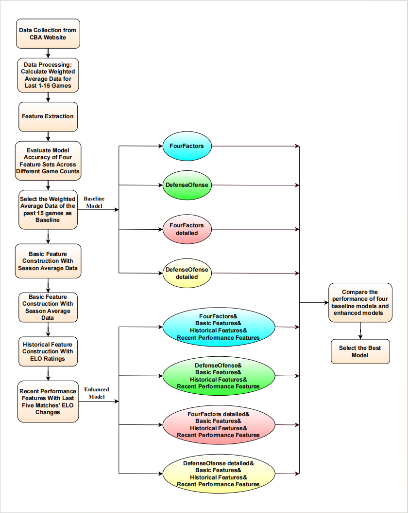

# Enhancing Game Outcome Prediction in the Chinese Basketball League through a Machine Learning Framework Based on Performance Data

This repository contains the code implementation for the paper **"Enhancing Game Outcome Prediction in the Chinese Basketball League through a Machine Learning Framework Based on Performance Data".**

📄 **[Read the paper here (Scientific Reports, 2025)](https://doi.org/10.1038/s41598-025-08882-7)**



**Corresponding Author:** Zhong Yuhua (Email: zhongyh39@mail2.sysu.edu.cn)

---

## 📌 Setup
### **Environment Requirements**
Ensure you have the following dependencies installed:
```bash
python==3.12.7
numpy==1.26.4
pandas==2.2.2
matplotlib==3.9.2
seaborn==0.13.2
scipy==1.13.1
torch==2.3.1
torchvision==0.18.1
tqdm==4.66.5
scikit-learn==1.5.1
xgboost==2.1.1
```
You can create a virtual environment and install dependencies with:
```bash
python -m venv venv
source venv/bin/activate  # On Windows, use: venv\Scripts\activate
pip install -r requirements.txt
```

### **Dataset**
The dataset is located in the `data/` folder and includes:
- All CBA League games from the **2021-2024** seasons.
- The last 15 games from the **2020-2021** season.

Each game record contains key statistics such as **points, rebounds, assists, steals**, and more.

---

## 🚀 Running the Code
### **Prerequisites**
Before running the experiments, ensure:
- The dataset file `CBA2020-2024数据集.xlsx` is placed inside the `data/` directory.
- All dependencies are installed.

### **Running Traditional Machine Learning Models**
Run different machine learning models using the following commands:

#### **Support Vector Machine (SVM)**
```bash
python main.py --model_type FourFactors --algorithm SVM --standardize True
```

#### **Naive Bayes**
```bash
python main.py --model_type FourFactors --algorithm NaiveBayes --standardize True
```

#### **Logistic Regression**
```bash
python main.py --model_type FourFactors --algorithm LogisticRegression --standardize True
```

#### **K-Nearest Neighbors (KNN)**
```bash
python main.py --model_type FourFactors --algorithm KNN --standardize True
```

#### **XGBoost**
```bash
python main.py --model_type FourFactors --algorithm XGBoost --standardize True
```

### **Running MLP Contrastive Learning**
To run the **Multi-Layer Perceptron (MLP) Contrastive Learning** model:
```bash
python main.py --model_type FourFactors --algorithm MLP_Contrastive --standardize True
```

### **Running Alternative Model Types**
To experiment with different model types (`FourFactors_detailed`, `DefenseOfense`, `DefenseOfense_detailed`), replace `FourFactors` in the above commands with the desired model type.

For example, to run **SVM** on `DefenseOfense_detailed`:
```bash
python main.py --model_type DefenseOfense_detailed --algorithm SVM --standardize True
```

---

## 📝 Notes
- Ensure the dataset is correctly placed before execution.
- The results will be **saved automatically** in the specified output directories.
- The number of iterations in **run_experiment()** and **run_experiment_mlp_contrastive()** can be modified to shorten the training time.

---

## 📖 Citation

If you find my work useful in your research, please consider citing my paper:

```bibtex
@article{zhong_enhancing_2025,
  title = {Enhancing game outcome prediction in the {Chinese} basketball league through a machine learning framework based on performance data},
  volume = {15},
  issn = {2045-2322},
  url = {https://doi.org/10.1038/s41598-025-08882-7},
  doi = {10.1038/s41598-025-08882-7},
  number = {1},
  journal = {Scientific Reports},
  author = {Zhong, Yuhua},
  month = jul,
  year = {2025},
  pages = {23788},
}
```

## 🙏 Acknowledgments
This project builds upon established methodologies from **sports analytics** and **machine learning research**. We appreciate the contributions from the research community that have helped shape this work.

---

For any issues, feel free to reach out to the corresponding author. 🚀

